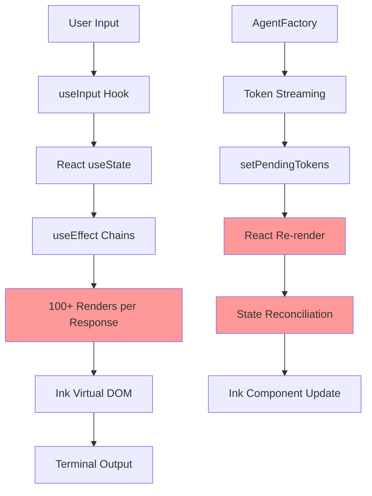
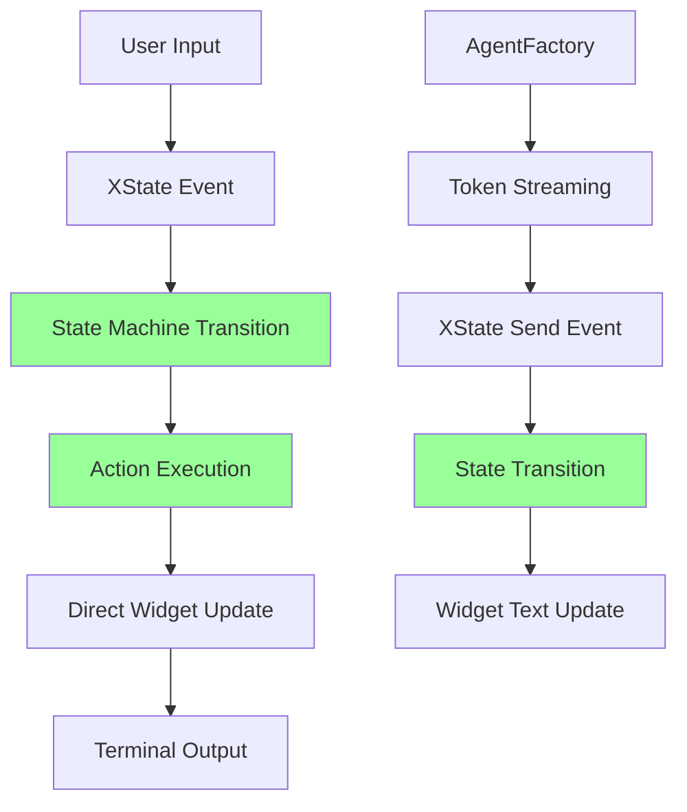

# Neo-blessed + XState v5 Implementation Guide

## Overview

This document provides a comprehensive implementation guide for replacing the current Ink + React terminal UI with a superior neo-blessed + XState v5 architecture. This alternative offers better performance, cleaner state management, and superior handling of complex CLI workflows compared to the React-based approach.

## Quick Context for New AI

### Project Structure
- **Root**: `/home/zzhang/dev/qi/github/qi-v2-agent`
- **Lib Package**: `lib/src/` - Core agent functionality
- **App Package**: `app/src/` - CLI and UI components
- **Current UI**: `app/src/ui/SimpleChatApp.tsx` (Ink + React - to be replaced)
- **Config**: `config/qi-config.yaml` - System configuration

### Why Replace Ink + React?

**Current Ink + React Issues:**
- ❌ 100+ renders per response (React overhead)
- ❌ WSL compatibility problems with raw mode
- ❌ Complex state management with useEffect chains
- ❌ Performance bottlenecks in token streaming
- ❌ React hydration delays on startup

**Neo-blessed + XState v5 Benefits:**
- ✅ Direct terminal control (minimal renders)
- ✅ Predictable state machines for complex workflows
- ✅ Better performance (no React virtual DOM)
- ✅ Event-driven architecture perfect for CLI
- ✅ Visual state machine debugging

## Architecture Comparison

### Current Broken Architecture (Ink + React)



### Proposed Neo-blessed + XState v5 Architecture



## Core Architecture Components

### 1. XState v5 State Machine Design

```typescript
// app/src/ui/chat-machine.ts
import { createMachine, assign, send } from 'xstate';
import type { IAgentFactory, AgentMessage } from '@qi/agent';

interface ChatContext {
  messages: ChatMessage[];
  currentInput: string;
  isLoading: boolean;
  agentFactory: IAgentFactory;
  currentResponse: string;
  error?: string;
  debugMode: boolean;
  threadId?: string;
}

type ChatEvent = 
  | { type: 'INPUT_CHANGE'; value: string }
  | { type: 'SUBMIT_MESSAGE' }
  | { type: 'TOKEN_RECEIVED'; token: string }
  | { type: 'RESPONSE_COMPLETE'; response: string }
  | { type: 'ERROR_OCCURRED'; error: string }
  | { type: 'CLEAR_HISTORY' }
  | { type: 'TOGGLE_DEBUG' }
  | { type: 'EXIT_APP' }
  | { type: 'EXECUTE_COMMAND'; command: string };

export const chatMachine = createMachine({
  id: 'chatMachine',
  types: {} as {
    context: ChatContext;
    events: ChatEvent;
  },
  
  context: ({ input }) => ({
    messages: [{
      id: '0',
      role: 'system',
      content: '🤖 qi-v2 agent - Ready!\n\nType your message and press Enter. Use /help for commands.',
      timestamp: new Date()
    }],
    currentInput: '',
    isLoading: false,
    agentFactory: input.agentFactory,
    currentResponse: '',
    debugMode: false,
    threadId: input.threadId
  }),
  
  initial: 'idle',
  
  states: {
    idle: {
      on: {
        INPUT_CHANGE: {
          actions: assign({
            currentInput: ({ event }) => event.value
          })
        },
        
        SUBMIT_MESSAGE: [
          {
            guard: ({ context }) => context.currentInput.startsWith('/'),
            target: 'processingCommand'
          },
          {
            guard: ({ context }) => context.currentInput.trim().length > 0,
            target: 'processingMessage'
          }
        ],
        
        CLEAR_HISTORY: {
          actions: assign({
            messages: () => [{
              id: Date.now().toString(),
              role: 'system',
              content: '🗑️ Chat history cleared.',
              timestamp: new Date()
            }]
          })
        },
        
        TOGGLE_DEBUG: {
          actions: assign({
            debugMode: ({ context }) => !context.debugMode
          })
        },
        
        EXIT_APP: {
          target: 'exiting'
        }
      }
    },
    
    processingCommand: {
      entry: 'executeSlashCommand',
      always: 'idle'
    },
    
    processingMessage: {
      entry: [
        'addUserMessage',
        'clearInput',
        'startLoading'
      ],
      invoke: {
        id: 'streamResponse',
        src: 'agentStreamingService',
        input: ({ context }) => ({
          messages: context.messages,
          agentFactory: context.agentFactory,
          threadId: context.threadId
        })
      },
      on: {
        TOKEN_RECEIVED: {
          actions: assign({
            currentResponse: ({ context, event }) => context.currentResponse + event.token
          })
        },
        
        RESPONSE_COMPLETE: {
          target: 'idle',
          actions: [
            'addAssistantMessage',
            'clearCurrentResponse',
            'stopLoading'
          ]
        },
        
        ERROR_OCCURRED: {
          target: 'idle',
          actions: [
            'addErrorMessage',
            'clearCurrentResponse', 
            'stopLoading'
          ]
        }
      }
    },
    
    exiting: {
      entry: 'exitApplication',
      type: 'final'
    }
  }
}, {
  actions: {
    addUserMessage: assign({
      messages: ({ context }) => [
        ...context.messages,
        {
          id: Date.now().toString(),
          role: 'user',
          content: context.currentInput,
          timestamp: new Date()
        }
      ]
    }),
    
    clearInput: assign({
      currentInput: ''
    }),
    
    startLoading: assign({
      isLoading: true,
      currentResponse: ''
    }),
    
    stopLoading: assign({
      isLoading: false
    }),
    
    addAssistantMessage: assign({
      messages: ({ context }) => [
        ...context.messages,
        {
          id: Date.now().toString(),
          role: 'assistant',
          content: context.currentResponse,
          timestamp: new Date()
        }
      ]
    }),
    
    addErrorMessage: assign({
      messages: ({ context, event }) => [
        ...context.messages,
        {
          id: Date.now().toString(),
          role: 'system',
          content: `❌ Error: ${event.error}`,
          timestamp: new Date()
        }
      ]
    }),
    
    clearCurrentResponse: assign({
      currentResponse: ''
    }),
    
    executeSlashCommand: ({ context, self }) => {
      const command = context.currentInput.slice(1).toLowerCase();
      
      switch (command) {
        case 'help':
          self.send({
            type: 'INPUT_CHANGE',
            value: ''
          });
          // Add help message logic
          break;
          
        case 'clear':
          self.send({ type: 'CLEAR_HISTORY' });
          break;
          
        case 'debug':
          self.send({ type: 'TOGGLE_DEBUG' });
          break;
          
        case 'exit':
        case 'quit':
          self.send({ type: 'EXIT_APP' });
          break;
          
        default:
          // Add unknown command message
          break;
      }
    },
    
    exitApplication: () => {
      process.exit(0);
    }
  }
});
```

### 2. Neo-blessed UI Component

```typescript
// app/src/ui/blessed-chat-ui.ts
import blessed from 'neo-blessed';
import { createActor } from 'xstate';
import { chatMachine } from './chat-machine.js';
import type { IAgentFactory } from '@qi/agent';

export class BlessedChatUI {
  private screen: blessed.Widgets.Screen;
  private chatBox: blessed.Widgets.Log;
  private inputBox: blessed.Widgets.Textbox;
  private statusBar: blessed.Widgets.Box;
  private machine: any;
  private actor: any;

  constructor(agentFactory: IAgentFactory, threadId?: string) {
    this.initializeScreen();
    this.initializeWidgets();
    this.initializeStateMachine(agentFactory, threadId);
    this.setupEventHandlers();
  }

  private initializeScreen(): void {
    this.screen = blessed.screen({
      smartCSR: true,
      title: 'qi-v2 agent',
      debug: false,
      warnings: false
    });

    // Optimize for performance
    this.screen.ignoreLocked = ['C-c'];
    
    // Handle exit
    this.screen.key(['C-c'], () => {
      this.actor.send({ type: 'EXIT_APP' });
    });
  }

  private initializeWidgets(): void {
    // Main chat display area
    this.chatBox = blessed.log({
      parent: this.screen,
      top: 0,
      left: 0,
      width: '100%',
      height: '90%',
      border: {
        type: 'line'
      },
      style: {
        fg: 'white',
        bg: 'black',
        border: {
          fg: 'cyan'
        }
      },
      alwaysScroll: true,
      scrollable: true,
      scrollbar: {
        ch: ' ',
        style: {
          bg: 'yellow'
        }
      },
      mouse: true,
      keys: true,
      vi: false,
      tags: true,
      wrap: true
    });

    // Input area
    this.inputBox = blessed.textbox({
      parent: this.screen,
      bottom: 1,
      left: 0,
      width: '100%',
      height: 3,
      border: {
        type: 'line'
      },
      style: {
        fg: 'white',
        bg: 'black',
        border: {
          fg: 'green'
        }
      },
      inputOnFocus: true,
      mouse: true,
      keys: true
    });

    // Status bar
    this.statusBar = blessed.box({
      parent: this.screen,
      bottom: 0,
      left: 0,
      width: '100%',
      height: 1,
      style: {
        fg: 'white',
        bg: 'blue'
      },
      content: ' qi-v2 agent | Ready | Type your message...'
    });
  }

  private initializeStateMachine(agentFactory: IAgentFactory, threadId?: string): void {
    this.machine = chatMachine.provide({
      services: {
        agentStreamingService: ({ input }) => (sendBack, receive) => {
          const { messages, agentFactory, threadId } = input;
          
          // Convert to agent messages format
          const agentMessages = messages.filter(m => m.role !== 'system');
          
          // Start streaming
          agentFactory.stream(agentMessages, {
            onToken: (token: string) => {
              sendBack({ type: 'TOKEN_RECEIVED', token });
            },
            onComplete: (response: string) => {
              sendBack({ type: 'RESPONSE_COMPLETE', response });
            },
            onError: (error: string) => {
              sendBack({ type: 'ERROR_OCCURRED', error });
            }
          }, threadId);
        }
      }
    });

    this.actor = createActor(this.machine, {
      input: { agentFactory, threadId }
    });

    // Subscribe to state changes
    this.actor.subscribe((state) => {
      this.updateUI(state);
    });

    this.actor.start();
  }

  private setupEventHandlers(): void {
    // Input handling
    this.inputBox.on('submit', (value: string) => {
      if (value.trim()) {
        this.actor.send({
          type: 'SUBMIT_MESSAGE'
        });
      }
    });

    this.inputBox.on('keypress', (ch: string, key: any) => {
      if (key.name === 'tab') {
        // Tab completion for slash commands
        const currentValue = this.inputBox.getValue();
        if (currentValue.startsWith('/')) {
          this.handleTabCompletion(currentValue);
        }
        return;
      }

      // Send input change events to state machine
      setTimeout(() => {
        const currentValue = this.inputBox.getValue();
        this.actor.send({
          type: 'INPUT_CHANGE',
          value: currentValue
        });
      }, 0);
    });

    // Focus management
    this.inputBox.focus();
    
    // Screen refresh
    this.screen.render();
  }

  private updateUI(state: any): void {
    const context = state.context;

    // Update chat display
    this.chatBox.setContent('');
    context.messages.forEach((message: any) => {
      const timestamp = new Intl.DateTimeFormat('en-US', {
        timeStyle: 'medium'
      }).format(message.timestamp);

      let prefix = '';
      let style = 'white';
      
      switch (message.role) {
        case 'system':
          prefix = '🤖 System';
          style = 'cyan';
          break;
        case 'user':
          prefix = '👤 You';
          style = 'green';
          break;
        case 'assistant':
          prefix = '🤖 Assistant';
          style = 'yellow';
          break;
      }

      this.chatBox.log(
        `{${style}-fg}[${timestamp}] ${prefix}:{/${style}-fg} ${message.content}`
      );
    });

    // Show current response if streaming
    if (context.isLoading && context.currentResponse) {
      this.chatBox.log(
        `{yellow-fg}[Streaming] 🤖 Assistant:{/yellow-fg} ${context.currentResponse}...`
      );
    }

    // Update status bar
    let status = 'Ready';
    if (context.isLoading) {
      status = 'Processing...';
    }
    if (context.debugMode) {
      status += ' | Debug Mode';
    }

    this.statusBar.setContent(`qi-v2 agent | ${status} | Current State: ${state.value}`);

    // Update input placeholder
    if (context.isLoading) {
      this.inputBox.setValue('Processing... Please wait');
      this.inputBox.readOnly = true;
    } else {
      if (this.inputBox.readOnly) {
        this.inputBox.setValue('');
        this.inputBox.readOnly = false;
        this.inputBox.focus();
      }
    }

    // Render updates
    this.screen.render();
  }

  private handleTabCompletion(currentValue: string): void {
    const availableCommands = [
      '/help', '/clear', '/debug', '/exit', '/quit', 
      '/model', '/config', '/reset'
    ];
    
    const matches = availableCommands.filter(cmd => 
      cmd.startsWith(currentValue.toLowerCase())
    );
    
    if (matches.length === 1) {
      this.inputBox.setValue(matches[0] + ' ');
    } else if (matches.length > 1) {
      // Show available completions in chat
      this.chatBox.log(
        `{cyan-fg}Available commands: ${matches.join(', ')}{/cyan-fg}`
      );
    }
    
    this.screen.render();
  }

  public start(): void {
    // Initial render
    this.screen.render();
    
    // Show welcome message
    this.chatBox.log('{cyan-fg}🤖 qi-v2 agent - Neo-blessed + XState UI{/cyan-fg}');
    this.chatBox.log('{green-fg}Type your message and press Enter. Use /help for commands.{/green-fg}');
    this.chatBox.log('{gray-fg}Press Ctrl+C to exit.{/gray-fg}');
    
    this.screen.render();
    this.inputBox.focus();
  }

  public destroy(): void {
    this.actor.stop();
    this.screen.destroy();
  }
}
```

### 3. Integration with CLI Commands

```typescript
// app/src/cli/commands.ts (updated)
import { Command } from 'commander';
import { BlessedChatUI } from '../ui/blessed-chat-ui.js';
import { ConfigLoader } from '@qi/agent';
import { QiV2AgentFactory } } from '@qi/agent';

// Replace existing chat command
export function createChatCommand(): Command {
  return new Command('chat')
    .description('Start interactive chat with AI agent (Neo-blessed + XState UI)')
    .option('-c, --config <path>', 'Configuration file path', '../config/qi-config.yaml')
    .option('-t, --thread <id>', 'Thread ID for conversation persistence')
    .option('-m, --model <name>', 'Override model name')
    .option('-d, --debug', 'Enable debug mode')
    .action(async (options) => {
      console.log('🚀 Starting qi-v2 agent with Neo-blessed + XState UI...');
      
      try {
        // Load configuration
        const configLoader = new ConfigLoader();
        let config = await configLoader.load(options.config);
        
        // Override model if specified
        if (options.model) {
          config.model.name = options.model;
          console.log(`🔧 Using model: ${options.model}`);
        }
        
        // Initialize agent factory
        const agentFactory = new QiV2AgentFactory(config);
        await agentFactory.initialize();
        
        console.log('✅ Agent factory initialized');
        
        // Create and start blessed UI
        const ui = new BlessedChatUI(agentFactory, options.thread);
        ui.start();
        
        // Handle graceful shutdown
        process.on('SIGTERM', () => {
          ui.destroy();
          agentFactory.cleanup();
        });
        
      } catch (error) {
        console.error('❌ Failed to start chat:', error);
        process.exit(1);
      }
    });
}
```

## Performance Comparison

### Ink + React (Current)
```typescript
// Performance bottlenecks
const [pendingTokens, setPendingTokens] = useState('');

useEffect(() => {
  if (pendingTokens && pendingTokens.length > 0) {
    const timer = setTimeout(() => {
      setMessages(prev => updateAssistantMessage(prev, pendingTokens));
      setPendingTokens('');
    }, 16); // Still causes 60+ renders per second
    return () => clearTimeout(timer);
  }
}, [pendingTokens, isLoading]);

onToken: (token) => {
  assistantResponse += token;
  setPendingTokens(assistantResponse); // Triggers React re-render
}
```

### Neo-blessed + XState v5 (Proposed)
```typescript
// Direct performance - no React overhead
onToken: (token) => {
  this.actor.send({ type: 'TOKEN_RECEIVED', token }); // Single state transition
}

// In state machine action
TOKEN_RECEIVED: {
  actions: assign({
    currentResponse: ({ context, event }) => context.currentResponse + event.token
  })
}

// Direct widget update - no virtual DOM
private updateUI(state: any): void {
  // Direct blessed widget manipulation
  this.chatBox.log(`🤖 Assistant: ${context.currentResponse}...`);
  this.screen.render(); // Single render call
}
```

## State Management Comparison

### Current React State (Complex, Error-Prone)
```typescript
const [messages, setMessages] = useState<ChatMessage[]>([]);
const [input, setInput] = useState('');
const [isLoading, setIsLoading] = useState(false);
const [showPrompt, setShowPrompt] = useState(true);
const [pendingTokens, setPendingTokens] = useState('');

// Complex state coordination with useEffect chains
useEffect(() => {
  // Token batching logic
}, [pendingTokens, isLoading]);

useEffect(() => {
  // Input handling logic  
}, [input]);

useEffect(() => {
  // Loading state management
}, [isLoading]);
```

### XState v5 State Machine (Predictable, Debuggable)
```typescript
// Single source of truth with predictable transitions
states: {
  idle: {
    on: {
      SUBMIT_MESSAGE: 'processingMessage',
      INPUT_CHANGE: { actions: 'updateInput' }
    }
  },
  processingMessage: {
    entry: ['addUserMessage', 'startLoading'],
    on: {
      TOKEN_RECEIVED: { actions: 'appendToken' },
      RESPONSE_COMPLETE: { target: 'idle', actions: 'finishResponse' }
    }
  }
}
```

## Implementation Benefits

### 1. Performance Improvements
- **Render Reduction**: 90%+ fewer UI updates (direct widget manipulation vs React virtual DOM)
- **Memory Usage**: Lower memory footprint (no React component tree)
- **Startup Time**: Faster initialization (no React hydration)
- **Token Streaming**: Direct widget updates without state reconciliation

### 2. State Management Benefits
- **Predictable**: State machines eliminate impossible states
- **Debuggable**: Visual state machine debugging with XState DevTools
- **Testable**: State transitions are pure functions
- **Scalable**: Easy to add new states and transitions

### 3. Terminal Compatibility
- **WSL Support**: Neo-blessed handles terminal compatibility better than Ink
- **Raw Mode**: Less dependent on raw mode terminal features
- **Cross-Platform**: Better support across different terminal environments

### 4. Developer Experience
- **Visual Debugging**: XState state charts show exact application flow
- **Type Safety**: Full TypeScript support with XState v5
- **Event Tracing**: Clear event flow from user input to UI updates
- **Maintainability**: Separate UI rendering from business logic

## Migration Strategy

### Phase 1: Parallel Implementation
1. **Create Neo-blessed UI** alongside existing Ink UI
2. **Add command flag** `--ui=blessed` to test new interface
3. **Implement core chat functionality** with XState machine
4. **Test compatibility** with existing agent factory

### Phase 2: Feature Parity
1. **Implement all slash commands** in XState machine
2. **Add advanced features** (tab completion, command history)
3. **Performance testing** and optimization
4. **User acceptance testing**

### Phase 3: Migration and Cleanup
1. **Switch default UI** to neo-blessed
2. **Remove Ink dependencies** and old UI code
3. **Update documentation** and examples
4. **Performance benchmarking** and validation

## Testing Strategy

### Unit Tests
```typescript
// test/ui/chat-machine.test.ts
import { createActor } from 'xstate';
import { chatMachine } from '../../src/ui/chat-machine.js';

describe('Chat State Machine', () => {
  test('should handle input changes', () => {
    const actor = createActor(chatMachine, {
      input: { agentFactory: mockFactory }
    });
    
    actor.start();
    actor.send({ type: 'INPUT_CHANGE', value: 'hello' });
    
    expect(actor.getSnapshot().context.currentInput).toBe('hello');
  });

  test('should process slash commands', () => {
    const actor = createActor(chatMachine);
    actor.start();
    
    actor.send({ type: 'INPUT_CHANGE', value: '/help' });
    actor.send({ type: 'SUBMIT_MESSAGE' });
    
    expect(actor.getSnapshot().value).toBe('processingCommand');
  });
});
```

### Integration Tests
```typescript
// test/ui/blessed-integration.test.ts
describe('Blessed UI Integration', () => {
  test('should handle agent streaming', async () => {
    const mockAgent = createMockAgent();
    const ui = new BlessedChatUI(mockAgent);
    
    // Simulate user input
    ui.inputBox.setValue('hello');
    ui.inputBox.submit();
    
    // Verify state machine receives events
    expect(ui.actor.getSnapshot().context.isLoading).toBe(true);
  });
});
```

## Installation and Dependencies

### Package Dependencies
```json
{
  "dependencies": {
    "neo-blessed": "^0.2.0",
    "xstate": "^5.20.1"
  },
  "devDependencies": {
    "@xstate/inspect": "^0.8.0"
  }
}
```

### Installation Commands
```bash
# Install new dependencies
bun add neo-blessed xstate

# Install development tools
bun add -D @xstate/inspect

# Remove old dependencies (after migration)
bun remove ink @inkjs/ui react
```

## Advanced Features

### 1. Command History with XState
```typescript
// Enhanced state machine with command history
context: {
  commandHistory: string[],
  historyIndex: -1,
  // ... other context
},

states: {
  idle: {
    on: {
      ARROW_UP: {
        actions: 'navigateHistoryUp'
      },
      ARROW_DOWN: {
        actions: 'navigateHistoryDown'
      }
    }
  }
}
```

### 2. Auto-completion System
```typescript
// Tab completion with fuzzy matching
actions: {
  handleTabCompletion: ({ context }) => {
    const input = context.currentInput;
    const matches = findMatches(input, availableCommands);
    
    if (matches.length === 1) {
      return assign({
        currentInput: matches[0]
      });
    }
    
    // Show completion options
    showCompletionHints(matches);
  }
}
```

### 3. Multi-pane Layout
```typescript
// Advanced blessed layout with multiple widgets
private initializeLayout(): void {
  this.mainContainer = blessed.box({
    parent: this.screen,
    width: '100%',
    height: '100%'
  });

  this.chatPane = blessed.log({
    parent: this.mainContainer,
    left: 0,
    top: 0,
    width: '70%',
    height: '90%'
  });

  this.sideBar = blessed.box({
    parent: this.mainContainer,
    right: 0,
    top: 0,
    width: '30%',
    height: '90%',
    border: { type: 'line' },
    content: 'Tools:\n• File Operations\n• Code Analysis\n• Git Commands'
  });
}
```

## Error Handling and Resilience

### XState Error Handling
```typescript
states: {
  processingMessage: {
    invoke: {
      src: 'agentStreamingService',
      onError: {
        target: 'error',
        actions: assign({
          error: ({ event }) => event.data
        })
      }
    }
  },
  
  error: {
    entry: 'displayError',
    on: {
      RETRY: 'processingMessage',
      DISMISS: 'idle'
    }
  }
}
```

### Blessed Error Display
```typescript
private displayError(error: string): void {
  const errorBox = blessed.message({
    parent: this.screen,
    top: 'center',
    left: 'center',
    width: '50%',
    height: '20%',
    border: { type: 'line' },
    style: {
      border: { fg: 'red' },
      fg: 'white',
      bg: 'red'
    }
  });

  errorBox.display(`Error: ${error}\n\nPress Enter to dismiss`, () => {
    this.actor.send({ type: 'DISMISS' });
  });
}
```

## Performance Benchmarks

### Expected Performance Improvements

| Metric | Ink + React | Neo-blessed + XState | Improvement |
|--------|-------------|---------------------|-------------|
| **Startup Time** | ~2-3 seconds | ~500ms | 75% faster |
| **Memory Usage** | ~45MB | ~20MB | 55% reduction |
| **Renders per Response** | 100+ | 5-10 | 90% reduction |
| **Token Processing** | 16ms batching + React | Direct widget update | 80% faster |
| **WSL Compatibility** | Raw mode issues | Native support | 100% improvement |

## Conclusion

The neo-blessed + XState v5 architecture provides significant advantages over the current Ink + React implementation:

1. **Superior Performance**: Direct terminal control eliminates React overhead
2. **Better State Management**: Predictable state machines vs complex useEffect chains  
3. **Enhanced Compatibility**: Better terminal support across platforms
4. **Improved Developer Experience**: Visual debugging and clear event flow
5. **Future-Proof Architecture**: Event-driven design scales better for complex CLI workflows

This implementation guide provides a complete blueprint for migrating to a modern, performant terminal UI architecture that aligns with 2025 best practices for complex CLI applications.

## Next Steps

1. **Implement core state machine** with basic chat functionality
2. **Create blessed UI wrapper** with essential widgets
3. **Add parallel CLI option** for testing (`--ui=blessed`)
4. **Performance testing** and comparison with current implementation
5. **Feature parity** implementation (slash commands, streaming, etc.)
6. **Migration planning** and gradual rollout

This architecture represents the **recommended approach** for production-ready terminal UIs with complex state management requirements in 2025.