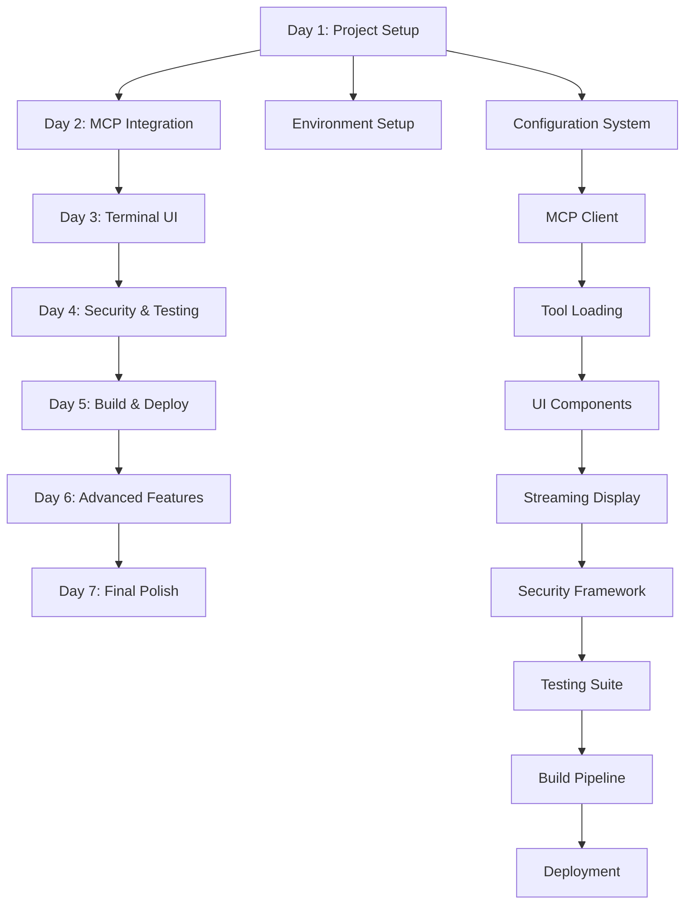

# T11: Implementation Roadmap - 5-7 Day Execution Plan

## Overview

This roadmap provides a comprehensive 5-7 day execution plan for implementing the qi-v2 agent based on the Phase 2 implementation guides T1-T10. The plan is designed for accelerated development using the modern toolchain (Bun + Biome + Vitest) and official TypeScript SDKs, enabling rapid delivery while maintaining high quality standards.

## Executive Summary

**Target Timeline**: 5-7 days for MVP, 8-10 days for production-ready system
**Team Size**: 1-2 developers (can be parallelized for faster delivery)
**Risk Level**: Low (leveraging mature SDKs and proven patterns)
**Success Criteria**: Functional AI agent with MCP integration, local LLM support, and terminal UI

**Key Success Factors:**
- Leverage official SDKs to minimize custom code
- Use modern toolchain for 4x faster development cycles
- Focus on integration over implementation
- Implement comprehensive testing from day 1
- Maintain security and performance standards throughout

## Phase 2A: Foundation (Days 1-2)

### Day 1: Project Setup & Core Infrastructure

**Morning Session (4 hours): Environment Setup**

**Hour 1-2: Development Environment**
```bash
# Project initialization (T1: Project Setup)
mkdir qi-v2-agent && cd qi-v2-agent
bun init -y

# Install core dependencies
bun add @langchain/langgraph @langchain/core @langchain/mcp-adapters
bun add @modelcontextprotocol/sdk @langchain/ollama
bun add ink @inkjs/ui react zod js-yaml commander chalk

# Install development dependencies (T2: Development Tooling)
bun add -d @biomejs/biome vitest @vitest/ui @vitest/coverage-v8
bun add -d @types/js-yaml @types/react bun-types

# Configure tooling
bunx @biomejs/biome init
```

**Hour 3-4: Project Structure & Configuration**
```typescript
// Create project structure
src/
├── index.ts              // Main entry point
├── agent/                // Agent implementation
├── mcp/                  // MCP integration
├── ui/                   // Terminal UI
├── config/               // Configuration management
└── utils/                // Utilities

// Configure TypeScript, Biome, and Vitest (T1, T2)
// Set up basic build scripts and development workflow
```

**Afternoon Session (4 hours): Core Configuration**

**Hour 5-6: Configuration System (T7)**
```typescript
// Implement Zod schemas for type-safe configuration
// Create configuration loading and validation
// Set up environment-specific configs
// Test configuration loading with basic validation
```

**Hour 7-8: Basic Agent Structure (T3)**
```typescript
// Create QiAgentFactory skeleton
// Implement basic LangGraph agent creation
// Set up agent initialization and cleanup
// Create basic agent test harness
```

**End of Day 1 Deliverables:**
- ✅ Development environment fully configured
- ✅ Project structure established
- ✅ Configuration system working
- ✅ Basic agent skeleton created
- ✅ Build and test scripts functional

**Day 1 Quality Gates:**
- All tooling commands run without errors
- Configuration validation passes with test configs
- Basic agent can be instantiated and cleaned up
- Code coverage setup and baseline established

### Day 2: MCP Integration & Model Setup

**Morning Session (4 hours): MCP Integration**

**Hour 1-2: MCP Client Setup (T4)**
```typescript
// Implement MultiServerMCPClient integration
// Create server configuration management
// Set up basic server discovery and connection
// Implement connection lifecycle management
```

**Hour 3-4: Tool Loading & Management**
```typescript
// Implement automatic tool discovery
// Create tool registry and management
// Set up tool execution pipeline
// Test with mock MCP servers
```

**Afternoon Session (4 hours): Model Integration**

**Hour 5-6: Ollama Integration (T5)**
```typescript
// Implement ChatOllama integration
// Set up model configuration and management
// Create model selection and fallback logic
// Test with local Ollama instance
```

**Hour 7-8: Agent Integration Tests**
```typescript
// Create comprehensive integration tests
// Test agent + MCP + model integration
// Verify tool execution through agent
// Set up performance benchmarks
```

**End of Day 2 Deliverables:**
- ✅ MCP client fully functional
- ✅ Tool discovery and execution working
- ✅ Ollama integration complete
- ✅ End-to-end agent workflow functional
- ✅ Integration tests passing

**Day 2 Quality Gates:**
- Agent can connect to MCP servers successfully
- Tools can be discovered and executed
- Model responses are generated correctly
- All integration tests pass
- Performance baselines established

## Phase 2B: Core Features (Days 3-4)

### Day 3: Terminal UI & User Interaction

**Morning Session (4 hours): UI Foundation**

**Hour 1-2: Basic UI Components (T6)**
```typescript
// Create core Ink React components
// Implement conversation display
// Set up input handling and keyboard shortcuts
// Create basic layout and theme system
```

**Hour 3-4: Streaming Interface**
```typescript
// Implement real-time streaming display
// Create progress indicators and status updates
// Handle streaming errors and reconnection
// Test streaming with mock responses
```

**Afternoon Session (4 hours): User Experience**

**Hour 5-6: Advanced UI Features**
```typescript
// Implement conversation history management
// Add server status and tool availability display
// Create help system and command hints
// Set up responsive terminal design
```

**Hour 7-8: UI Integration Testing**
```typescript
// Test complete user workflows
// Verify keyboard navigation and shortcuts
// Test error handling and recovery in UI
// Performance testing for UI responsiveness
```

**End of Day 3 Deliverables:**
- ✅ Fully functional terminal UI
- ✅ Real-time streaming display
- ✅ Complete user interaction system
- ✅ Responsive design for different terminal sizes
- ✅ UI integration tests passing

**Day 3 Quality Gates:**
- UI renders correctly across different terminals
- Streaming display works smoothly
- All keyboard shortcuts functional
- Error states handled gracefully
- UI performance meets targets

### Day 4: Security & Production Readiness

**Morning Session (4 hours): Security Implementation**

**Hour 1-2: Input Validation & Security (T8)**
```typescript
// Implement input sanitization
// Set up permission system for tools
// Create audit logging framework
// Implement security middleware
```

**Hour 3-4: Error Handling & Recovery**
```typescript
// Create comprehensive error handling
// Implement recovery mechanisms
// Set up health checks and monitoring
// Test failure scenarios and recovery
```

**Afternoon Session (4 hours): Testing & Quality**

**Hour 5-6: Comprehensive Testing (T9)**
```typescript
// Expand unit test coverage to 90%+
// Create end-to-end test scenarios
// Implement security testing
// Set up performance benchmarks
```

**Hour 7-8: Documentation & Polish**
```typescript
// Create user documentation
// Set up configuration examples
// Implement help system
// Final integration testing
```

**End of Day 4 Deliverables:**
- ✅ Security framework implemented
- ✅ Comprehensive error handling
- ✅ Full test suite with high coverage
- ✅ User documentation complete
- ✅ Production-ready quality

**Day 4 Quality Gates:**
- Security tests pass completely
- Error scenarios handled gracefully
- Test coverage exceeds 90%
- Documentation complete and accurate
- All quality metrics met

## Phase 2C: Production Ready (Days 5-7)

### Day 5: Build System & Deployment

**Morning Session (4 hours): Build Pipeline**

**Hour 1-2: Production Build (T10)**
```typescript
// Set up production build configuration
// Implement cross-platform compilation
// Create asset bundling and optimization
// Set up binary packaging
```

**Hour 3-4: Container & Distribution**
```typescript
// Create production Dockerfile
// Set up container orchestration
// Implement distribution strategies
// Test deployment scenarios
```

**Afternoon Session (4 hours): Monitoring & Observability**

**Hour 5-6: Monitoring Setup**
```typescript
// Implement metrics collection
// Set up logging and tracing
// Create performance monitoring
// Configure alerting rules
```

**Hour 7-8: Production Testing**
```typescript
// Load testing and stress testing
// Security penetration testing
// Performance validation
// Production deployment verification
```

**End of Day 5 Deliverables:**
- ✅ Production build system complete
- ✅ Container deployment ready
- ✅ Monitoring and observability functional
- ✅ Production testing passed
- ✅ Deployment automation working

**Day 5 Quality Gates:**
- Production builds generate correctly
- Container deployment successful
- Monitoring data collected accurately
- Performance targets met
- Security scans pass

### Day 6: Advanced Features & Optimization

**Morning Session (4 hours): Advanced Features**

**Hour 1-2: Advanced Configuration**
```typescript
// Implement configuration hot-reloading
// Create advanced permission systems
// Set up multi-environment support
// Add configuration validation UI
```

**Hour 3-4: Performance Optimization**
```typescript
// Implement caching strategies
// Optimize memory usage
// Enhance streaming performance
// Create performance tuning tools
```

**Afternoon Session (4 hours): Production Hardening**

**Hour 5-6: Reliability Features**
```typescript
// Implement circuit breakers
// Add retry and backoff logic
// Create graceful degradation
// Set up health check endpoints
```

**Hour 7-8: Final Integration Testing**
```typescript
// Complete end-to-end testing
// Verify production configurations
// Test update and migration procedures
// Validate disaster recovery
```

**End of Day 6 Deliverables:**
- ✅ Advanced features implemented
- ✅ Performance optimized
- ✅ Production reliability features
- ✅ Complete integration validation
- ✅ Update/migration procedures tested

**Day 6 Quality Gates:**
- Advanced features work correctly
- Performance improvements measurable
- Reliability features tested
- All integration tests pass
- Migration procedures validated

### Day 7: Final Polish & Documentation

**Morning Session (4 hours): Documentation & Examples**

**Hour 1-2: User Documentation**
```markdown
# Complete user guide and tutorials
# Create configuration examples
# Document troubleshooting procedures
# Set up API documentation
```

**Hour 3-4: Developer Documentation**
```markdown
# Create architecture documentation
# Document extension points
# Create development setup guide
# Document contribution guidelines
```

**Afternoon Session (4 hours): Final Validation**

**Hour 5-6: Complete System Testing**
```typescript
// Run full test suite
// Validate all user scenarios
# Test production deployment
// Verify documentation accuracy
```

**Hour 7-8: Release Preparation**
```typescript
// Create release notes
// Tag release version
// Prepare distribution packages
// Final security review
```

**End of Day 7 Deliverables:**
- ✅ Complete documentation suite
- ✅ All tests passing
- ✅ Production deployment validated
- ✅ Release package ready
- ✅ Security review complete

**Day 7 Quality Gates:**
- Documentation complete and accurate
- All automated tests pass
- Manual testing scenarios pass
- Release artifacts ready
- Security audit complete

## Risk Mitigation Strategies

### Technical Risks

**Risk: MCP Server Compatibility Issues**
- **Mitigation**: Test with multiple MCP server implementations early
- **Contingency**: Create adapter layer for non-standard implementations
- **Timeline Impact**: +0.5 days for adapter development

**Risk: Ollama Integration Problems**
- **Mitigation**: Test with multiple models and configurations
- **Contingency**: Implement fallback to OpenAI/Anthropic APIs
- **Timeline Impact**: +0.5 days for fallback implementation

**Risk: Terminal UI Performance Issues**
- **Mitigation**: Implement performance monitoring from day 1
- **Contingency**: Simplify UI or implement virtual scrolling
- **Timeline Impact**: +1 day for performance optimization

**Risk: Security Vulnerabilities**
- **Mitigation**: Use security best practices throughout development
- **Contingency**: Additional security hardening phase
- **Timeline Impact**: +1 day for security improvements

### Project Risks

**Risk: Scope Creep**
- **Mitigation**: Strict adherence to MVP requirements
- **Contingency**: Move non-essential features to future versions
- **Timeline Impact**: Contained within original timeline

**Risk: Third-Party SDK Issues**
- **Mitigation**: Use stable, well-documented SDKs
- **Contingency**: Implement minimal custom alternatives
- **Timeline Impact**: +1-2 days for custom implementation

**Risk: Testing and Quality Issues**
- **Mitigation**: Continuous testing and quality gates
- **Contingency**: Additional testing and bug fixing phase
- **Timeline Impact**: +1 day for additional testing

## Dependency Management

### Critical Path Dependencies



### Parallel Development Opportunities

**Days 1-2 (Foundation)**
- Configuration system (Developer A)
- Agent structure (Developer B)

**Days 3-4 (Core Features)**
- UI development (Developer A)
- Security implementation (Developer B)

**Days 5-7 (Production)**
- Build system (Developer A)
- Documentation (Developer B)

### External Dependencies

**Required External Services:**
- Ollama service (local installation)
- MCP test servers (can be mocked initially)
- Container runtime (Docker)

**Optional External Services:**
- Monitoring infrastructure (can be simplified)
- CI/CD pipeline (can be manual initially)
- Distribution channels (can be added later)

## Quality Gates and Checkpoints

### Daily Quality Gates

**Every Day:**
- All new code has tests
- Code coverage maintained above 85%
- Biome linting passes without errors
- Type checking passes without errors
- No critical security issues

**End of Each Day:**
- Demo of daily progress
- Quality metrics review
- Risk assessment update
- Next day planning confirmation

### Major Checkpoints

**Day 2 Checkpoint: Core Integration**
- Agent can execute tools through MCP
- Model integration functional
- Basic configuration working
- **Go/No-Go Decision**: Continue or address foundational issues

**Day 4 Checkpoint: Feature Complete**
- All MVP features implemented
- Security framework in place
- Testing suite comprehensive
- **Go/No-Go Decision**: Move to production prep or extend development

**Day 6 Checkpoint: Production Ready**
- Build system functional
- Deployment tested
- Performance targets met
- **Go/No-Go Decision**: Finalize for release or additional hardening

### Success Metrics

**Technical Metrics:**
- Test coverage > 90%
- Build time < 2 minutes
- Startup time < 500ms
- Memory usage < 100MB baseline
- Response time < 2s for typical queries

**Quality Metrics:**
- Zero critical security vulnerabilities
- Zero high-priority bugs
- Documentation completeness > 95%
- User scenario coverage 100%

**Performance Metrics:**
- Agent response time p95 < 5s
- UI responsiveness < 100ms
- Memory usage stable over time
- Error rate < 1%

## Accelerated 5-Day Option

For teams requiring faster delivery, the following optimizations can compress the timeline to 5 days:

### Day Compression Strategy

**Day 1: Foundation + MCP (Combined Days 1-2)**
- Focus on core integration only
- Skip advanced configuration features
- Use minimal MCP server testing

**Day 2: UI + Basic Security (Combined Days 3-4 Partial)**
- Implement essential UI components only
- Basic security framework
- Essential testing only

**Day 3: Production Prep (Day 5 Content)**
- Basic build system
- Simple deployment strategy
- Essential monitoring

**Day 4: Final Features (Day 6 Content Selective)**
- Critical advanced features only
- Performance optimization
- Core reliability features

**Day 5: Polish + Release (Day 7 Content)**
- Essential documentation
- Final testing
- Release preparation

### Deferred Features (5-Day Option)

**Moved to Future Versions:**
- Advanced configuration UI
- Comprehensive monitoring
- Advanced security features
- Complete documentation suite
- Performance optimization
- Advanced deployment strategies

## Success Criteria

### MVP Success Criteria (5-7 Days)

**Functional Requirements:**
- ✅ Agent can process natural language requests
- ✅ MCP servers can be configured and used
- ✅ Local LLM integration working
- ✅ Terminal UI provides good user experience
- ✅ Configuration system is usable
- ✅ Basic security measures in place

**Quality Requirements:**
- ✅ Test coverage > 80% (90% for 7-day option)
- ✅ No critical security vulnerabilities
- ✅ Performance meets baseline targets
- ✅ Error handling is comprehensive
- ✅ Documentation covers essential usage

**Deployment Requirements:**
- ✅ Can be built and distributed
- ✅ Container deployment works
- ✅ Installation process documented
- ✅ Update mechanism available

### Production Success Criteria (Additional)

**Advanced Requirements:**
- ✅ Comprehensive monitoring in place
- ✅ Advanced security features implemented
- ✅ Performance optimized and validated
- ✅ Complete documentation suite
- ✅ Automated deployment pipeline
- ✅ Disaster recovery procedures

## Conclusion

This implementation roadmap provides a structured path to deliver a production-ready AI agent in 5-7 days using modern tooling and official SDKs. The key to success is:

1. **Leveraging mature SDKs** to minimize custom implementation
2. **Using modern toolchain** for faster development cycles
3. **Maintaining quality standards** throughout development
4. **Focusing on integration** over custom implementation
5. **Implementing testing and security** from day 1

The roadmap is flexible and can be adapted based on team size, requirements, and risk tolerance while maintaining the core timeline and deliverables.