# Workflow Implementation Guide

## Overview

This guide provides a roadmap for implementing AI coding workflows in the Qi Agent, based on research of leading tools (Claude Code CLI, Cursor Composer Agent, Aider AI) and analysis of user needs in 2024-2025.

## Research Foundation

### Analysis of Leading Tools

**Claude Code CLI Features:**
- Direct file editing with natural language commands
- Git workflow automation with intelligent commit messages
- Codebase-aware analysis using @codebase context
- Memory management via CLAUDE.md project files
- Slash commands for repeated workflows

**Cursor Composer Agent Features:**
- Multi-file operations with codebase understanding
- Terminal command execution integration
- Context-aware editing across entire projects
- Real-time debugging and error fixing

**Aider AI Features:**
- Automatic git commits with descriptive messages
- Lint-and-fix workflows with automatic error correction
- Test generation and execution with failure fixing
- Large codebase refactoring capabilities

### Core Workflow Categories Identified

1. **File Operations** - Edit, analyze, explain code
2. **Git Integration** - Commit, diff, review workflows  
3. **Quality Assurance** - Test, lint, refactor operations
4. **Project Intelligence** - Search, debug, generate capabilities

## Incremental Implementation Roadmap

### Implementation Timeline

The following diagram shows the incremental implementation approach based on user value and complexity:


### Implementation Priority Matrix

```mermaid
graph TB
    %% Current State
    Current["`**v-0.2.3 CURRENT**
    ✅ chat command
    ✅ config management  
    ✅ MCP filesystem server
    ✅ Validated architecture`"]
    
    %% v-0.2.4 Foundation
    v024["`**v-0.2.4 Foundation**
    🎯 Essential file workflows
    📅 Week 1-2 (7 days)
    🔧 12 tools → 15+ tools`"]
    
    File1["`**edit Command**
    Priority: ⭐⭐⭐⭐⭐
    Value: Immediate file editing
    Complexity: Medium`"]
    
    File2["`**analyze Command**
    Priority: ⭐⭐⭐⭐
    Value: Code understanding
    Complexity: Low`"]
    
    File3["`**explain Command**
    Priority: ⭐⭐⭐⭐
    Value: Learning support
    Complexity: Low`"]
    
    %% v-0.2.5 Git Integration
    v025["`**v-0.2.5 Git Integration**
    🎯 Daily productivity workflows
    📅 Week 3 (5 days)
    🔧 Add git MCP server`"]
    
    Git1["`**commit Command**
    Priority: ⭐⭐⭐⭐
    Value: Auto commit messages
    Complexity: Medium`"]
    
    Git2["`**diff Command**
    Priority: ⭐⭐⭐
    Value: Change analysis
    Complexity: Low`"]
    
    Git3["`**review Command**
    Priority: ⭐⭐⭐
    Value: Code quality
    Complexity: Medium`"]
    
    %% v-0.2.6 Quality
    v026["`**v-0.2.6 Quality**
    🎯 Code confidence workflows
    📅 Week 4 (5 days)
    🔧 Add shell MCP server`"]
    
    Quality1["`**test Command**
    Priority: ⭐⭐⭐
    Value: Quality assurance
    Complexity: High`"]
    
    Quality2["`**refactor Command**
    Priority: ⭐⭐⭐
    Value: Code improvement
    Complexity: High`"]
    
    Quality3["`**lint Command**
    Priority: ⭐⭐
    Value: Style consistency
    Complexity: Medium`"]
    
    %% v-0.3.x Advanced
    v03x["`**v-0.3.x Advanced**
    🎯 Full Claude Code parity
    📅 Week 5+ (10+ days)
    🔧 Complete feature set`"]
    
    Adv1["`**search Command**
    Priority: ⭐⭐
    Value: Codebase navigation
    Complexity: High`"]
    
    Adv2["`**debug Command**
    Priority: ⭐⭐
    Value: Error resolution
    Complexity: Very High`"]
    
    Adv3["`**generate Command**
    Priority: ⭐
    Value: Code generation
    Complexity: Very High`"]
    
    %% Flow
    Current --> v024
    v024 --> File1
    v024 --> File2
    v024 --> File3
    
    v024 --> v025
    v025 --> Git1
    v025 --> Git2
    v025 --> Git3
    
    v025 --> v026
    v026 --> Quality1
    v026 --> Quality2
    v026 --> Quality3
    
    v026 --> v03x
    v03x --> Adv1
    v03x --> Adv2
    v03x --> Adv3
    
    %% Styling
    classDef current fill:#e8f5e8,stroke:#2e7d32,stroke-width:3px
    classDef foundation fill:#e3f2fd,stroke:#1976d2,stroke-width:2px
    classDef git fill:#fff3e0,stroke:#f57c00,stroke-width:2px
    classDef quality fill:#fce4ec,stroke:#c2185b,stroke-width:2px
    classDef advanced fill:#f3e5f5,stroke:#7b1fa2,stroke-width:2px
    classDef high fill:#ffebee,stroke:#d32f2f,stroke-width:2px
    
    class Current current
    class v024,File1,File2,File3 foundation
    class v025,Git1,Git2,Git3 git
    class v026,Quality1,Quality2,Quality3 quality
    class v03x,Adv1,Adv2,Adv3 advanced
```



**Key Implementation Insights:**

1. **✅ Foundation First**: File workflows provide immediate value and validate workflow patterns
2. **🔄 Incremental Value**: Each version adds meaningful capabilities without breaking existing functionality
3. **📈 Complexity Progression**: Start with simple commands, build to complex multi-step workflows
4. **🎯 User-Driven Priority**: Based on analysis of Claude Code, Cursor, and Aider usage patterns

### v-0.2.4 (File Workflows) - Essential Foundation

**Priority: HIGH** - Foundation for all AI coding assistants

#### CLI Command Flow

The following diagram shows the detailed flow from user command to workflow execution:


#### Commands to Implement

**`edit` Command**
```bash
# AI-assisted file editing
bun --cwd app src/main.ts edit path/to/file.ts
bun --cwd app src/main.ts edit --interactive  # Multi-file editing
```

**Implementation Approach:**
- Extend existing CLI command structure in `app/src/cli/commands.ts`
- Create new workflow class: `app/src/workflows/edit.ts`
- Use existing MCP filesystem server for file operations
- Integrate with LangGraph for complex multi-step editing

**`analyze` Command**
```bash
# Code/file analysis
bun --cwd app src/main.ts analyze path/to/file.ts
bun --cwd app src/main.ts analyze --codebase  # Full project analysis
```

**Implementation Approach:**
- Leverage existing QiAgentFactory for code understanding
- Use filesystem MCP server for file reading
- Implement context-aware analysis similar to Cursor's approach

**`explain` Command**
```bash
# Code explanation
bun --cwd app src/main.ts explain path/to/function.ts:45
bun --cwd app src/main.ts explain --concept "async/await patterns"
```

**Implementation Approach:**
- Build on existing streaming capabilities
- Use precise file/line targeting
- Provide educational explanations like Claude Code

#### Technical Implementation - CORRECTED PATTERNS ✅

**Integration with Validated Architecture:**

The workflow commands integrate with the proven `AgentFactory → Smart Router → LangGraph Agent → MCP Tools` pattern that delivers 12ms response times and 90% render reduction.

**CLI Command Structure:**
```typescript
// app/src/cli/commands.ts - Integrates with validated AgentFactory pattern
program
  .command('edit')
  .description('AI-assisted file editing')
  .argument('[files...]', 'Files to edit')
  .option('-i, --interactive', 'Interactive multi-file editing')
  .option('-m, --message <msg>', 'Edit instruction')
  .action(async (files, options) => {
    // Use existing validated chat infrastructure for workflows
    const { SimpleChatApp } = await import('../ui/SimpleChatApp.tsx');
    
    // Create workflow context messages that trigger smart routing
    const workflowMessages = createEditWorkflowMessages(files, options);
    
    // Leverage existing optimized UI with token batching
    render(<SimpleChatApp 
      agentFactory={agentFactory} 
      threadId={options.thread}
      workflowMode="edit"
      initialMessages={workflowMessages}
      onExit={cleanup}
    />);
  });
```

**Workflow Message Construction:**
```typescript
// app/src/workflows/messages.ts - Leverages smart routing
function createEditWorkflowMessages(files: string[], options: EditWorkflowOptions): AgentMessage[] {
  const instruction = options.message || 'Please help me edit these files';
  const fileList = files.join(', ');
  
  // This message will trigger needsTools=true in smart router
  const workflowMessage = {
    role: 'user',
    content: `${instruction}

Files to edit: ${fileList}

Please read the files, understand the code, and help me make the requested changes. Use the filesystem tools to read and write files as needed.`
  };
  
  return [workflowMessage];
}
```

**Smart Router Integration:**
The existing smart router in `lib/src/agent/factory.ts` will automatically detect tool requirements:
```typescript
// This triggers LangGraph agent path (not direct LLM)
const needsTools = messages.some(msg => 
  msg.content.toLowerCase().includes('file') ||     // ✅ Triggered by "Files to edit"
  msg.content.toLowerCase().includes('read') ||     // ✅ Triggered by "read the files"
  msg.content.toLowerCase().includes('write')       // ✅ Triggered by "write files"
);
```

### v-0.2.5 (Git Workflows) - High Developer Value

**Priority: MEDIUM** - Immediate daily productivity gains

#### Commands to Implement

**`commit` Command**
```bash
# AI-generated commit messages
bun --cwd app src/main.ts commit
bun --cwd app src/main.ts commit --conventional  # Conventional commits format
```

**`diff` Command**
```bash
# Change analysis
bun --cwd app src/main.ts diff
bun --cwd app src/main.ts diff --staged
```

**`review` Command**
```bash
# Code review
bun --cwd app src/main.ts review
bun --cwd app src/main.ts review --pr 123
```

#### Implementation Strategy

- Add git MCP server to default configuration
- Implement git operations through MCP tool calls
- Follow Aider's auto-commit patterns
- Use conventional commit format by default

### v-0.2.6 (Quality Workflows) - Developer Experience

**Priority: MEDIUM** - Code confidence and quality

#### Commands to Implement

**`test` Command**
```bash
# Test generation and execution
bun --cwd app src/main.ts test --generate path/to/file.ts
bun --cwd app src/main.ts test --run --fix
```

**`refactor` Command**
```bash
# Code improvement
bun --cwd app src/main.ts refactor path/to/file.ts
bun --cwd app src/main.ts refactor --pattern "extract-component"
```

**`lint` Command**
```bash
# Quality checks and fixes
bun --cwd app src/main.ts lint
bun --cwd app src/main.ts lint --fix
```

### v-0.3.x+ (Advanced Workflows) - Full Parity

**Priority: LOW** - Complete Claude Code feature parity

#### Commands to Implement

- `search` - Intelligent codebase search
- `debug` - Error analysis and systematic debugging  
- `generate` - Code generation from specifications
- `docs` - Documentation generation

## Architecture Integration

### Workflow Architecture Overview

The following diagram shows how workflow commands integrate with the validated AgentFactory architecture pattern:


**Key Integration Points:**

1. **✅ Reuses Validated Architecture**: Workflows leverage the proven AgentFactory → Smart Router → LangGraph pattern
2. **✅ Performance Optimized**: Inherits 12ms response times and 90% render reduction automatically
3. **✅ Tool Integration**: Uses existing MCP Manager and filesystem/git servers
4. **✅ UI Consistency**: Same optimized SimpleChatApp with token batching and static components

### Integration with Validated Architecture ✅

**No QiAgentFactory Changes Required:**

The existing `QiAgentFactory` in `lib/src/agent/factory.ts` already provides all necessary workflow capabilities through the validated `stream()` method. No modifications needed.

**Validated Pattern Benefits:**
- ✅ **Smart routing** automatically detects workflow tool requirements
- ✅ **Streaming optimization** provides 90% render reduction for all workflows
- ✅ **MCP integration** through existing MCPManager handles all tool orchestration
- ✅ **Error handling** and timeouts already implemented and tested

**CLI Integration Pattern:**
```typescript
// app/src/cli/commands.ts - Uses existing validated infrastructure
program
  .command('edit')
  .description('AI-assisted file editing')
  .argument('[files...]', 'Files to edit')
  .option('-m, --message <msg>', 'Edit instruction')
  .action(async (files, options) => {
    // Reuse existing chat infrastructure (validated)
    const { SimpleChatApp } = await import('../ui/SimpleChatApp.tsx');
    const workflowMessages = createEditWorkflowMessages(files, options);
    
    // All workflows use the same optimized rendering and streaming
    render(<SimpleChatApp 
      agentFactory={agentFactory}  // ✅ Existing validated factory
      initialMessages={workflowMessages}
      workflowMode="edit"
      onExit={cleanup}
    />);
  });
```

**Message-Based Workflow Pattern:**
```typescript
// app/src/workflows/messages.ts - Triggers validated smart routing
function createEditWorkflowMessages(files: string[], options: any): AgentMessage[] {
  return [{
    role: 'user',
    content: `Please help me edit these files: ${files.join(', ')}

Instructions: ${options.message || 'Please review and improve the code'}

Use the filesystem tools to read, analyze, and write the files as needed.`
    // ↑ This content triggers needsTools=true in smart router
  }];
}
```

### MCP Server Integration

The following diagram shows how different MCP servers integrate with workflow commands:

```mermaid
graph LR
    %% Workflow Commands
    EditCmd["`**edit Command**
    File operations`"]
    
    AnalyzeCmd["`**analyze Command**
    Code analysis`"]
    
    CommitCmd["`**commit Command**
    Git operations`"]
    
    TestCmd["`**test Command**
    Quality operations`"]
    
    %% MCP Manager (Central Hub)
    MCPManager["`**MCP Manager**
    lib/src/mcp/manager.ts
    ✅ Validated Integration`"]
    
    %% MCP Servers
    FileServer["`**Filesystem Server**
    @modelcontextprotocol/server-filesystem
    ✅ Already configured`"]
    
    GitServer["`**Git Server**
    @modelcontextprotocol/server-git
    📋 v-0.2.5 addition`"]
    
    ShellServer["`**Shell Server**
    @modelcontextprotocol/server-shell
    📋 v-0.2.6 addition`"]
    
    %% Tools Available
    FileTools["`**File Tools**
    fs_read_file()
    fs_write_file()
    fs_list_directory()
    fs_create_directory()`"]
    
    GitTools["`**Git Tools**
    git_status()
    git_diff()
    git_commit()
    git_log()`"]
    
    ShellTools["`**Shell Tools**
    shell_execute()
    shell_run_command()
    shell_get_env()`"]
    
    %% Workflow Routing
    EditCmd --> MCPManager
    AnalyzeCmd --> MCPManager
    CommitCmd --> MCPManager
    TestCmd --> MCPManager
    
    %% Server Connections
    MCPManager --> FileServer
    MCPManager --> GitServer
    MCPManager --> ShellServer
    
    %% Tool Provisioning
    FileServer --> FileTools
    GitServer --> GitTools
    ShellServer --> ShellTools
    
    %% Tool Usage Examples
    FileTools -.->|"edit workflow"| EditExample["`Read file.ts
    Analyze code
    Write fixed file.ts`"]
    
    GitTools -.->|"commit workflow"| CommitExample["`git_status()
    git_diff()
    git_commit(message)`"]
    
    ShellTools -.->|"test workflow"| TestExample["`npm test
    npm run lint
    bun run build`"]
    
    %% Styling
    classDef workflow fill:#e3f2fd,stroke:#1976d2,stroke-width:2px
    classDef validated fill:#e8f5e8,stroke:#2e7d32,stroke-width:2px
    classDef planned fill:#fff3e0,stroke:#f57c00,stroke-width:2px
    classDef tools fill:#f3e5f5,stroke:#7b1fa2,stroke-width:2px
    
    class EditCmd,AnalyzeCmd,CommitCmd,TestCmd workflow
    class MCPManager,FileServer validated
    class GitServer,ShellServer planned
    class FileTools,GitTools,ShellTools tools
```



**Integration Benefits:**

1. **✅ Validated Foundation**: Filesystem server already working with 12 tools loaded
2. **🔄 Incremental Addition**: Git and Shell servers add capabilities without breaking existing functionality
3. **🎯 Tool Orchestration**: LangGraph agent automatically selects appropriate tools for each workflow
4. **⚡ Performance**: All MCP calls benefit from validated streaming and agent optimizations

### MCP Server Requirements

**Required MCP Servers by Version:**

**v-0.2.4 (File Workflows):**
- ✅ filesystem (already configured)

**v-0.2.5 (Git Workflows):**
- ➕ git server (`@modelcontextprotocol/server-git`)

**v-0.2.6 (Quality Workflows):**
- ➕ shell server for running tests/lint tools

**Configuration Updates:**
```yaml
# config/qi-config.yaml
mcp:
  servers:
    filesystem:
      transport: stdio
      command: "npx"
      args: ["-y", "@modelcontextprotocol/server-filesystem", "."]
    
    git:  # v-0.2.5+
      transport: stdio
      command: "npx"
      args: ["-y", "@modelcontextprotocol/server-git"]
    
    shell:  # v-0.2.6+
      transport: stdio
      command: "npx"
      args: ["-y", "@modelcontextprotocol/server-shell"]
```

### Workflow Execution Examples

The following diagrams show detailed execution flows for key workflow commands:


**Workflow Execution Benefits:**

1. **🔄 Consistent Pattern**: All workflows follow the same AgentFactory → Smart Router → LangGraph → MCP → UI flow
2. **⚡ Performance**: Inherit all validated optimizations (12ms LLM response, 90% render reduction)
3. **🛠️ Tool Integration**: Seamless MCP tool orchestration without custom implementations
4. **📊 Measurable Results**: Clear performance expectations based on validated architecture

## Implementation Guidelines

### Design Principles

1. **Incremental Value** - Each workflow provides immediate user benefit
2. **Architecture Consistency** - Build on existing QiAgentFactory patterns
3. **User Experience** - Follow established CLI patterns from research
4. **Backward Compatibility** - New workflows don't break existing chat functionality
5. **Configuration Driven** - Workflows can be enabled/disabled via config

### Model Configuration and Performance ⚡

**Critical Model Requirement:**

Based on validation testing, workflow performance is directly tied to model selection:

```yaml
# config/qi-config.yaml - REQUIRED for optimal workflow performance
model:
  name: "qwen3:0.6b"          # ✅ TESTED - 12ms first token  
  # name: "kirito1/qwen3-coder:4b"  # ❌ AVOID - causes hanging/slow responses
  temperature: 0.1
  baseUrl: "http://localhost:11434"
  thinkingEnabled: false
```

**Performance Validation Results:**

| Model | First Token | Response Quality | Workflow Suitability |
|-------|-------------|------------------|---------------------|
| `qwen3:0.6b` | **✅ 12ms** | ✅ Excellent | ✅ **Production Ready** |
| `kirito1/qwen3-coder:4b` | ❌ 10+ seconds | ⚠️ Inconsistent | ❌ **Avoid for workflows** |
| `deepseek-r1` | ⚠️ Variable | ✅ Good | ⚠️ May require tuning |

**Workflow Performance Expectations:**

```
✅ VALIDATED PERFORMANCE (with qwen3:0.6b):
- Agent initialization: ~4 seconds (one-time cost)
- File read operations: ~50ms per file  
- LLM analysis: ~500ms-2s depending on complexity
- File write operations: ~30ms per file
- UI streaming: ~100ms with 90% render reduction

Total workflow time: 2-4 seconds for typical edit/analyze/commit operations
```

**Performance Monitoring:**

Use existing test scripts to validate workflow performance:
```bash
# Test LLM response time
bun test-response.js

# Test tool integration
bun test-tool-request.js  

# Test streaming performance
bun test-batching.js
```

### Development Process

**Phase 1: Planning (1 day)**
- Design CLI command structure
- Define workflow interfaces
- Plan MCP server integration

**Phase 2: Core Implementation (3-4 days)**
- Implement workflow classes
- Add CLI commands
- Basic functionality without UI polish

**Phase 3: User Experience (2-3 days)**
- Add interactive features
- Improve error handling
- Polish terminal UI

**Phase 4: Testing & Documentation (1-2 days)**
- Add tests for new workflows
- Update usage documentation
- Validate with real use cases

### Testing Strategy

**Leverage Existing Validated Test Scripts:**

The repository includes proven test scripts that validate the architecture patterns workflows will inherit:

```bash
# Performance Testing (Based on validated test-*.js scripts)
bun test-response.js       # ✅ Validates 12ms LLM response time
bun test-tool-request.js   # ✅ Validates MCP tool integration  
bun test-batching.js       # ✅ Validates UI token batching
bun test-delay-analysis.js # ✅ Identifies performance bottlenecks
bun test-hang-debug.js     # ✅ Tests stream completion handling
```

**Workflow-Specific Testing:**

```bash
# Workflow Integration Tests (New - based on validated patterns)
bun test-edit-workflow.js    # Test edit command end-to-end
bun test-commit-workflow.js  # Test commit message generation
bun test-analyze-workflow.js # Test code analysis workflows

# Performance Validation (Using existing validated scripts as baseline)
bun test-workflow-performance.js  # Measure workflow execution times
bun test-mcp-integration.js       # Validate new MCP servers (git, shell)
```

**Testing Architecture:**

```typescript
// test/workflows/edit.test.ts - Follows validated patterns
describe('Edit Workflow', () => {
  let agentFactory: QiAgentFactory;
  
  beforeAll(async () => {
    // Use same initialization pattern as validated tests
    const config = configLoader.loadConfig();
    agentFactory = new QiAgentFactory(config);
    await agentFactory.initialize();
  });
  
  test('should edit file using validated AgentFactory.stream() pattern', async () => {
    const messages = createEditWorkflowMessages(['test/fixtures/sample.ts'], {
      message: 'add error handling'
    });
    
    // Test using existing validated streaming pattern
    let response = '';
    await agentFactory.stream(messages, {
      onToken: (token) => response += token,
      onComplete: (final) => response = final,
      onError: (error) => fail(error.message)
    });
    
    expect(response).toContain('added error handling');
    // Validate file was actually modified via MCP filesystem server
  });
});
```

**Integration Testing:**
- ✅ **Reuse validated MCP integration** from existing test-tool-request.js
- ✅ **Reuse validated streaming patterns** from existing test-batching.js  
- ✅ **Reuse validated performance benchmarks** from existing test-response.js

**User Testing:**
- Real project workflows using validated chat infrastructure
- Performance validation against established 12ms/90% reduction benchmarks
- Error handling testing using validated timeout and completion patterns

## Success Metrics

### v-0.2.4 Success Criteria
- [ ] Users can edit files with natural language commands
- [ ] File analysis provides useful code insights
- [ ] Code explanation helps understanding complex logic
- [ ] Workflows integrate smoothly with existing chat functionality

### v-0.2.5 Success Criteria
- [ ] Git commit messages are contextually appropriate
- [ ] Diff analysis helps with code review
- [ ] Review workflow catches common issues
- [ ] Git integration doesn't interfere with existing workflows

### v-0.2.6 Success Criteria
- [ ] Test generation creates useful test cases
- [ ] Refactoring improves code quality safely
- [ ] Lint workflow fixes common code issues
- [ ] Quality workflows integrate with project tooling

## Future Considerations

### Community Feedback Integration
- Collect user feedback after each version release
- Prioritize most-requested workflows for next versions
- Adapt implementation based on real usage patterns

### Performance Optimization
- Optimize for large codebase workflows
- Implement caching for repeated operations
- Consider parallel processing for multi-file operations

### Advanced Features
- Custom workflow creation (like Claude Code's slash commands)
- Workflow composition and chaining
- Integration with external tools and APIs

This implementation guide provides a clear, research-based roadmap for building comprehensive AI coding workflows while maintaining the incremental, user-focused approach that has made tools like Claude Code and Aider successful.